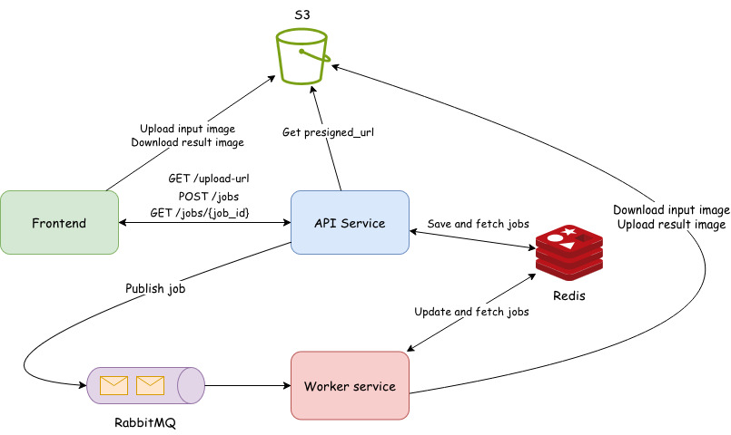

# Morphological Operations Web App


A full-stack web application for applying morphological image processing operations through an intuitive browser-based interface.

Morphological operations are a set of image processing techniques designed to manipulate the structure of images. These operations work by sliding a small matrix, called a structuring element, over the image to enhance, suppress, or extract specific features. This includes classical operations such as dilation, erosion, opening, and closing, as well as more specialized ones like top-hat, bottom-hat, and contour extraction.

The application allows users to upload an image, configure the desired operation and structuring element, and asynchronously retrieve the processed result.

## Architecture
<p align="center">
    
</p>

The application is structured as a full-stack solution. The Frontend provides a responsive interface that uploads images directly to an S3 bucket using presigned URLs. A Flask API orchestrates the process by registering jobs in Redis and queuing tasks via RabbitMQ, decoupling user requests from heavy computation.

The actual image processing is handled by a dedicated Worker service. This service consumes tasks from the queue, processes the images from S3, uploads the results back to S3, and updates the final job status in Redis for the frontend to poll.

## Workflow

1. **Frontend**: Requests a Presigned URL from the API and uploads the input image directly to Amazon S3 (or MinIO). It then submits the job parameters to the API.
2. **API Service**: Persists the job metadata in Redis and publishes a task message to RabbitMQ to initiate asynchronous processing.
3. **RabbitMQ**: Acts as the message broker, securely queuing jobs and distributing them to available background workers.
4. **Worker Service**: Consumes the task from the queue, downloads the original image from S3, executes the morphological transformation, and uploads the processed result back to S3. Finally, it updates the job status in Redis.
5. **Status Polling**: The frontend periodically polls the API to monitor progress. Once the task is marked as completed, the API provides a presigned URL to securely download the result image.

## Tech stack

- **Frontend**: HTML5, CSS3, JavaScript, Nginx.
- **Backend**: Python, Flask
- **Message Broker**: RabbitMQ for asynchronous task queuing.
- **State Store**: Redis for real-time job tracking and status storage.
- **Object Storage**: MinIO (S3-compatible) for image persistence.
- **Infrastructure**: Terraform (IaC) for bucket provisioning.

## Technical Decisions

**Decoupled Processing**: Separating the API from the workers via RabbitMQ allows the system to handle traffic spikes and scale workers independently..

**S3 Presigned URLs**: Images are uploaded directly from the browser to object storage, reducing API load and avoiding large file transfers through Flask.

**Task Persistence**: Using Redis for job status allows for fast, non-blocking lookups during frontend polling.

**Reliability**: A GitHub Actions workflow is integrated to run automated tests and check code coverage on every push.

## Running the Application

### Prerequisites
- Docker  
- Docker Compose  
- Terraform


### Setup

1. Configure credentials in `infra/terraform.tfvars` for minIO:
   ```hcl
   minio_access_key = "YOUR_ACCESS_KEY"
   minio_secret_key = "YOUR_SECRET_KEY"
   ```

2. Create a `.env` file in the project root and configure MinIO credentials:
   ```env
   MINIO_ROOT_USER=your_minio_user
   MINIO_ROOT_PASSWORD=your_minio_password
   ```

3. Start the MinIO service:
   ```bash
   docker-compose up -d minio
   ```

4. Provision the bucket using Terraform:
   ```bash
   cd infra
   terraform init
   terraform apply
   cd ..
   ```

5. Launch the full application:
   ```bash
   docker-compose up -d
   ```
Once running, the web interface will be available at: **http://localhost:8000**

## Using the Application

Start by dragging and dropping an image into the designated area or clicking to upload a file. Then, select the desired morphological operation, choose the structuring element’s shape and size, and click the "Execute Operation" button. The backend will process the image asynchronously, and the processed result will be displayed once ready.

This demo showcases contour extraction from a black-and-white image. By selecting the "Contour extraction" operation, the application highlights the contours of shapes present in the image.

<p align="center">

</p>
