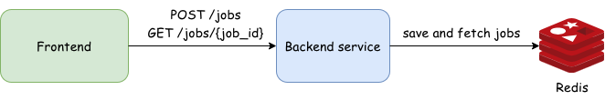

# Morphological Operations Web App

Morphological operations are a set of image processing techniques designed to manipulate the structure of images. These operations work by sliding a small matrix, called a structuring element, over the image to enhance, suppress, or extract specific features. This includes classical operations such as dilation, erosion, opening, and closing, as well as more specialized ones like top-hat, bottom-hat, and contour extraction.

This project provides a web-based interface that allows users to upload images, select the desired morphological operation, and configure the shape and size of the structuring element. Once submitted, the application processes the image and returns the transformed result.

## Architecture
<p align="center">
    
</p>

The application is structured as a full-stack solution with three main components. The frontend is built using HTML, CSS, and vanilla JavaScript, providing a clean user interface with drag-and-drop image upload and real-time file previews. The backend is powered by Python + Flask, which handles job management, execution of morphological operations, and returning results to the client. Redis serves as a lightweight job store, persisting the state of each image processing task, such as pending, running, completed, or error.

The frontend and backend are tightly integrated: the frontend sends job requests to Flask endpoints, and then polls Redis via the backend to determine job status.
## Technical Decisions

For job management, tasks are stored in Redis with a defined time-to-live (TTL). This allows asynchronous processing of potentially long-running operations without blocking the main application. The frontend periodically polls the backend to check the job status, implementing an exponential backoff strategy to reduce unnecessary network requests and server load.

On the frontend side, the user experience has been prioritized with drag-and-drop functionality, immediate file previews, and input validation for file type and size. This ensures that only appropriate images are submitted, reducing errors and server load.

Flask was chosen for the backend because of its lightweight nature and minimal overhead. 

The project includes a GitHub Actions workflow that runs automated tests and checks test coverage on every push and pull request. This ensures code quality and reliability.

The entire application is containerized using Docker, which guarantees a consistent environment.

## Running the Application

To run this project, you need to have Docker installed. Launching the application is straightforward. Simply execute:

```
docker-compose up -d
```

This command will start the containers for both the Flask web application and Redis. Once the containers are running, the web interface can be accessed at [http://localhost:8000](http://localhost:8000).

## Using the Application

Start by dragging and dropping an image into the designated area or clicking to upload a file. Then, select the desired morphological operation, choose the structuring element’s shape and size, and click the "Execute Operation" button. The backend will process the image asynchronously, and the processed result will be displayed once ready.

This demo showcases contour extraction from a black-and-white image. By selecting the "Contour extraction" operation, the application highlights the contours of shapes present in the image.

<p align="center">

</p>
